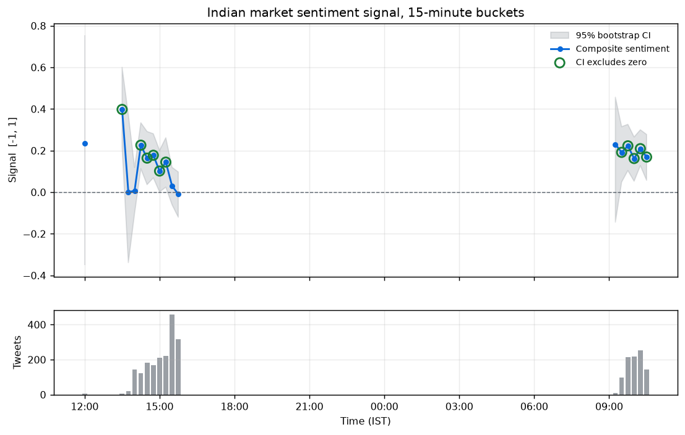

# Indian Market Tweet Intelligence

Real-time collection and quantitative signal extraction from Indian equity
market discussion on X/Twitter. No paid APIs.

Collects tweets about NIFTY, BANKNIFTY, and SENSEX, converts them into
numerical features, and aggregates those into a time-bucketed sentiment
signal with confidence intervals -- then tests that signal against realised
NIFTY 50 returns.

## Results

| Metric | Value |
|---|---|
| Tweets collected (deduplicated, 24h window) | **2,838** |
| Unique authors | 1,549 |
| Tweets carrying a scoreable sentiment term | 39.1% |
| 15-minute buckets (above reliability floor) | 46 (17) |
| TF-IDF matrix | 2,838 x 31,992, 1.03% dense |
| Storage compression (JSONL to Parquet+ZSTD) | 20.8x |

Full results, including the signal series and validation tables, are in
[`outputs/results.md`](outputs/results.md).

## Quick start

    python3 -m venv .venv && source .venv/bin/activate
    pip install -r requirements.txt
    pip install -e .

    cp .env.example .env      # add X session cookies (see Authentication)

    python scripts/collect.py --target 8000    # scrape; resumable
    python scripts/process.py                  # clean, dedupe, write Parquet
    python scripts/run_analysis.py             # signals, figures, report

Each stage is independent and re-runnable. `collect.py` checkpoints after
every query, so it can be interrupted and resumed without losing work.

## Authentication

X removed anonymous access to its search endpoints, so collection requires
a logged-in session. `snscrape`, `Twint`, and `Nitter` all depended on the
guest tokens that were withdrawn and no longer function.

Create a throwaway X account, sign in, and copy the `auth_token` and `ct0`
cookies from DevTools (Application -> Cookies -> `https://x.com`) into
`.env`:

    X_ACCOUNT_1=burner1:AUTH_TOKEN:CT0

Multiple accounts may be listed as `X_ACCOUNT_2`, `X_ACCOUNT_3`, and so on.
The scraper rotates between them automatically when one is rate-limited,
which is the only way to increase throughput -- X allows roughly 50 search
requests per 15-minute window per account.

Never commit `.env` or `accounts.db`; both are gitignored.

## Architecture

    collect.py --> data/raw/tweets.jsonl --> process.py --> data/processed/
                     (append-only,                           (Parquet,
                      checkpointed)                            date/hour)
                                                                  |
                                                                  v
                                                          run_analysis.py
                                                                  |
                              +-----------------------------------+------------+
                              v                       v                        v
                      outputs/signals.*       outputs/figures/          results.md

| Module | Responsibility |
|---|---|
| `scraper/query_planner.py` | Partitions the search space into disjoint queries |
| `scraper/collector.py` | Executes the plan with checkpointing and rate-limit handling |
| `processing/clean.py` | Unicode normalisation, entity extraction, schema mapping |
| `processing/dedup.py` | Exact (ID set) and near-duplicate (MinHash-LSH) removal |
| `processing/storage.py` | Partitioned Parquet with ZSTD compression |
| `signals/lexicon.py` | Domain sentiment lexicon and content classifier |
| `signals/features.py` | TF-IDF, engagement weighting, per-tweet confidence |
| `signals/aggregate.py` | Bucketing, composite signal, bootstrap and Wilson intervals |
| `signals/validate.py` | Correlation against realised NIFTY 50 returns |
| `viz/lttb.py` | LTTB downsampling, streaming histograms, reservoir sampling |
| `viz/plots.py` | Figures, all built under bounded memory |

## Design decisions

Full reasoning is in [`docs/TECHNICAL.md`](docs/TECHNICAL.md). The four
decisions that most shaped the result:

**A single search query cannot reach 2,000 tweets.** X's Latest tab stalls
its pagination cursor at roughly 300 results, so volume comes from
partitioning the search space -- 8 term groups x 24 time slices, with slice
width inversely proportional to expected density (30 minutes during the
09:15-15:30 IST cash session, 2 hours overnight).

**Two filters were costing 92% of retrievable volume.** Measured directly:
an identical term group and time window returned 25 tweets with
`lang:en -filter:retweets` and 335 without. Most Indian fintwit is Hinglish
and is tagged inconsistently as `en`, `hi`, or `und`; retweets carry their
own engagement metrics and are flagged during processing instead.

**General sentiment models do not work on this corpus.** "CE" and "PE" are
the dominant directional vocabulary and read as neutral to any standard
lexicon; hashtags are engagement bait rather than sentiment (a bullish call
tagged `#CRASH` is common); Hinglish carries clean signal that English-only
models cannot see. The lexicon encodes all three.

**Roughly a quarter of tweets carry no view at all.** Automated earnings
summaries, SEBI notices, and Closing Auction Session mechanics are not
weakly-worded opinion -- they are non-directional information. A classifier
separates them, so sentiment coverage is reported against the subset that
plausibly expresses a view rather than being diluted by feeds that never do.

## Indian market context

Several design choices depend on how these markets actually trade:

- **Session hours.** NSE and BSE trade 09:15-15:30 IST. Tweet volume tracks
  this closely, so the query planner allocates 30-minute slices to the cash
  session and 2-hour slices overnight.
- **Closing Auction Session.** `CAS` ranks second only to `nifty` by TF-IDF
  weight in this corpus. It is NSE's call-auction mechanism for setting the
  closing price, and speculation about where it will print dominates the
  15:30-15:45 IST window. It is classified as mechanical, not directional.
- **Options vocabulary.** Indian retail traders express direction almost
  entirely through option legs. A bare strike-plus-leg token (`24450 ce`)
  frequently constitutes the entire claim, with no verb, so it is matched
  by pattern rather than by lexicon entry.
- **Institutional flow.** FII/DII positioning is closely tracked and widely
  reported by retail accounts, and carries its own directional weight.

## Testing

    python -m pytest tests/ -q     # 30 tests

Tests target the logic where a silent bug would corrupt results rather than
raise: option-leg polarity, negation handling, hashtag exclusion, Wilson
interval bounds, and LTTB's extreme-preservation property.

## Limitations

- **Validation is underpowered.** With 15-16 usable in-hours buckets from a
  partial session, no correlation reaches significance (all p > 0.4). The
  analysis can detect a strong relationship but cannot rule out a modest
  one. No lag or horizon search was performed, since that would manufacture
  significance without predictive content.
- **The lexicon is hand-built.** Weights are assigned from domain knowledge
  and are the most subjective component of the pipeline. They are tested
  against prices rather than assumed correct.
- **Scraping is fragile by nature.** X rotates its GraphQL operation IDs and
  tightens anti-bot measures regularly; the collector needs maintenance.
- **Single account, single session.** Throughput is capped by one account's
  rate limit, and the corpus covers part of one trading day.

## Legal note

This collects publicly visible posts only. Scraping X is a Terms of Service
matter, not a criminal one, but it can result in account suspension -- use a
throwaway account, as the setup instructions specify. No authentication
walls are bypassed and no private data is accessed.
