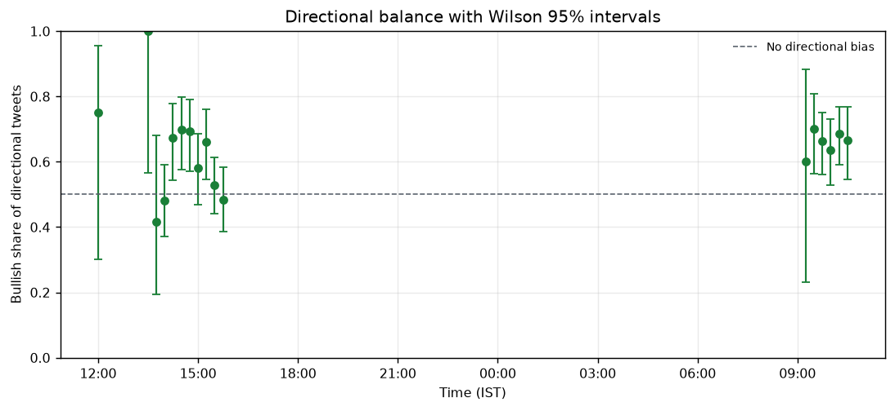
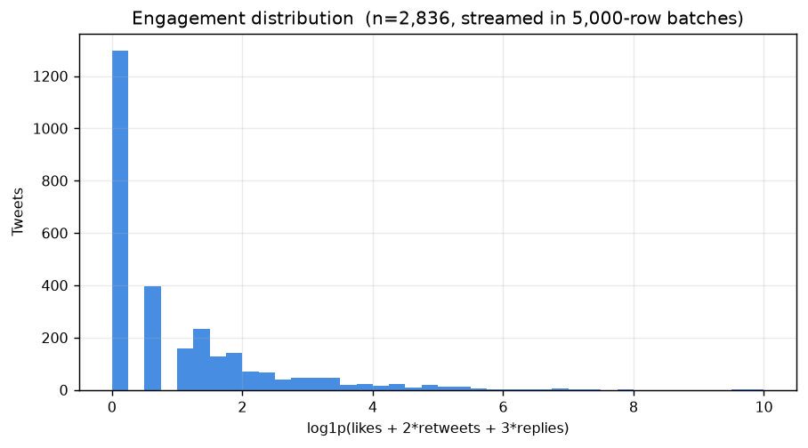
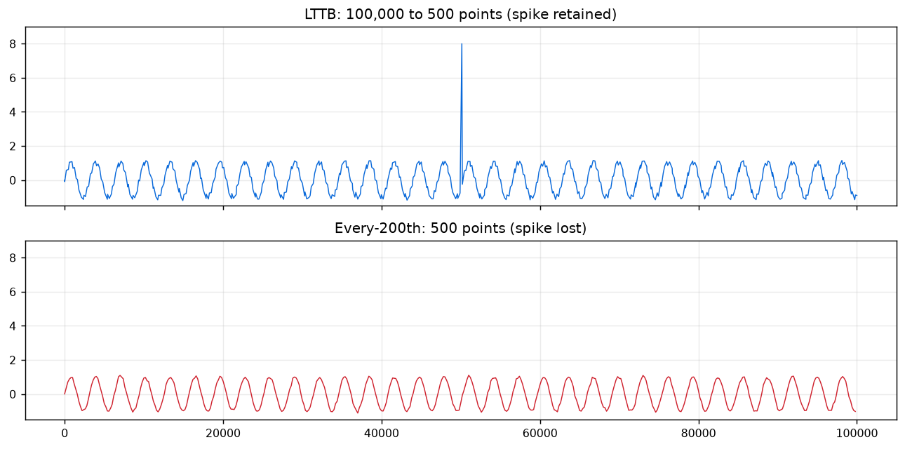

# Analysis Results

## Corpus

- Tweets (deduplicated, 24h window): **2,834**
- Unique authors: 1,548
- Mean lexicon polarity: +0.049
- Tweets carrying a scoreable term: 39.1%
- Promotional (tout) tweets: 0.9%

### Content classes

| Class | Tweets |
|---|---:|
| discussion | 2,069 |
| mechanical | 386 |
| earnings | 192 |
| corporate_action | 187 |

## Signal series

44 buckets total, 17 above the reliability floor (>=5 tweets and >=3 carrying a scoreable term).

| Time (IST) | Tweets | Scoreable | Signal | 95% CI | Bullish share |
|---|---:|---:|---:|---|---:|
| 04 Aug 12:00 | 6 | 4 | +0.233 | [-0.350, +0.755] | 75% [30%, 95%] |
| 04 Aug 13:30 | 5 | 5 | +0.398 | [+0.216, +0.600] | 100% [57%, 100%] |
| 04 Aug 13:45 | 21 | 12 | +0.000 | [-0.339, +0.372] | 42% [19%, 68%] |
| 04 Aug 14:00 | 142 | 77 | +0.007 | [-0.101, +0.119] | 48% [37%, 59%] |
| 04 Aug 14:15 | 123 | 58 | +0.226 | [+0.113, +0.334] | 67% [54%, 78%] |
| 04 Aug 14:30 | 184 | 67 | +0.164 | [+0.036, +0.292] | 70% [58%, 80%] |
| 04 Aug 14:45 | 167 | 69 | +0.178 | [+0.069, +0.281] | 69% [57%, 79%] |
| 04 Aug 15:00 | 210 | 81 | +0.102 | [+0.001, +0.201] | 58% [47%, 69%] |
| 04 Aug 15:15 | 222 | 73 | +0.145 | [+0.024, +0.262] | 66% [55%, 76%] |
| 04 Aug 15:30 | 459 | 134 | +0.030 | [-0.060, +0.120] | 53% [44%, 61%] |
| 04 Aug 15:45 | 316 | 97 | -0.010 | [-0.120, +0.097] | 48% [38%, 58%] |
| 05 Aug 09:15 | 10 | 5 | +0.230 | [-0.144, +0.457] | 60% [23%, 88%] |
| 05 Aug 09:30 | 99 | 51 | +0.192 | [+0.049, +0.315] | 70% [56%, 81%] |
| 05 Aug 09:45 | 213 | 95 | +0.223 | [+0.104, +0.326] | 66% [56%, 75%] |
| 05 Aug 10:00 | 219 | 88 | +0.162 | [+0.053, +0.265] | 64% [53%, 73%] |
| 05 Aug 10:15 | 252 | 106 | +0.209 | [+0.128, +0.300] | 69% [59%, 77%] |
| 05 Aug 10:30 | 144 | 68 | +0.169 | [+0.057, +0.278] | 67% [55%, 77%] |

## Validation against NIFTY 50

| Horizon | n | Pearson r | p | Spearman r | p | Hit rate |
|---|---:|---:|---:|---:|---:|---|
| 15m | 16 | -0.226 | 0.400 | -0.389 | 0.137 | 68.8% [44%, 86%] |
| 30m | 16 | -0.153 | 0.572 | -0.386 | 0.140 | 56.2% [33%, 77%] |
| 60m | 16 | -0.032 | 0.906 | -0.180 | 0.506 | 81.2% [57%, 93%] |

**Interpretation.** No correlation reaches significance at the 5% level. Sample sizes here are very small -- a handful of buckets overlap NSE trading hours, because collection covered only part of one session -- so this analysis can detect a strong relationship but cannot rule out a modest one. Point estimates at these sample sizes are not evidence in either direction, and no lag or horizon search was performed, since that would manufacture significance without predictive content. Establishing whether the signal carries information requires collection across multiple sessions.

## Corpus characteristics

Engagement is power-law distributed, which is why the aggregation layer weights by `log1p` of the interaction composite rather than raw counts: on a linear scale a single viral tweet would outweigh several hundred ordinary ones.

## Downsampling

Largest-Triangle-Three-Buckets reduces 100,000 points to 500 (99.5% reduction) while retaining an isolated spike that every-200th sampling discards at the same point budget.

## Top TF-IDF terms

| Term | Mean weight |
|---|---:|
| `nifty` | 0.0454 |
| `sensex` | 0.0188 |
| `cas` | 0.0182 |
| `nse` | 0.0168 |
| `market` | 0.0149 |
| `nifty50` | 0.0135 |
| `expiry` | 0.0132 |
| `today` | 0.0127 |
| `bse` | 0.0126 |
| `trading` | 0.0125 |
| `price` | 0.0115 |
| `banknifty` | 0.0115 |
| `stockmarket` | 0.0111 |
| `closing` | 0.0105 |
| `sebi` | 0.0097 |
